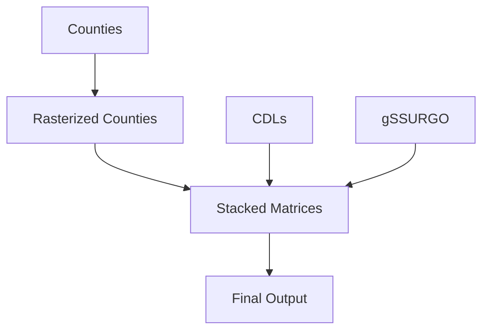

# USCROPSOIL
This repository includes Matlab Scripts to tabulate crop information, soil information in lower 48 US states based on Cropland Data Layers (2008 and onwards) and gSSURGO maps. Each 30 meter cells from CDL will also have other spatial location information such as county, HUC8 and HUC12 information based on the center of the CDL cells.

# Summary
This repository is an extension of https://github.com/haipai/CDL2gssurgo which is based on state Cropland Data Layers. Due to the large size of both National CDL layers and gSSURGO maps, there will be only MATLAB scripts here. Interested users can download the necessary data files. 

# Data Downloading 
1. National CDL (https://www.nass.usda.gov/Research_and_Science/Cropland/Release/index.php) 
2. gSSURGO database (https://www.nrcs.usda.gov/resources/data-and-reports/gridded-soil-survey-geographic-gssurgo-database). version: gSSURGO_CONUS_202210.gdb.zip
3. County shape file (https://www2.census.gov/geo/tiger/GENZ2022/shp/?C=S;O=D) version: cb_2022_us_county_500k.zip
4. Water Boundary Database (https://www.usgs.gov/national-hydrography/access-national-hydrography-products) version: 202301

# WorkFlow Diagram 

# DataFrame Structure

1. A[Counties]: a shape file with your interested spatial units. Here, we use US counties as the example.
2. B[Rasterized Counties]: a geoTIFF raster file with the same spatial reference as C[CDLs] and snapped (the cells in B and C are aligned with the same corner coordinates).
3. C[CDLs]: downloaded raste CDLs and converted to netCDF to support regional reading of data. 
4. D[gSSURGO]: converted netCDF file from gSSURGO_CONUS_202210.gdb.
5. E[Stacked Matrices]: a set of Matlab Matrices, such as county matrix, each year's CDL matrix, and the soil matrix from D[gSSURGO]. Depending on the research objectives, if the goal is to work at field level (CDL cells), the data compiling work should stop at this step. For summary analysis, such as want to know soil conditions by crop by county in each year, F[Final Output] is needed. 
6. F[Final Output]: a dataframe in the long format includes crop, soil at each county in each year. The dataframe looks like: [County],[Year],[Crop],[SoilMapkey],[Area].

# Note 

1. the raster files should use the same spatial reference and cells need to be snapped (overlapped cells are matched exactly between raster files). In this way, the coordinates of cells are the same among raster files. CDLs and Soil map have the same spatial reference already. 
2. netCDF will keep the data matrix in the direction of rows (latitudes ranked from north to south), and columns (longtitudes ranked from west to east). Matlab **ncread**  function will read the same matrix as if rows (longitudes ranked from west to east), and columns (latitudes ranked from north to south). Attention is needed here. 

# Scripts
Since I have not find efficient Matlab function to rasterize shapefiles, to export raster files to netCDF files, The B[Rasterized Counties] and D[gSSURGO] are completed in Acrgis Pro 2.9 with Polygon to Raster function ([Polygon to Rasterr](https://pro.arcgis.com/en/pro-app/latest/tool-reference/conversion/polygon-to-raster.htm) and Raster to netCDF function (https://pro.arcgis.com/en/pro-app/2.9/tool-reference/multidimension/raster-to-netcdf.htm). The core Matlab functions used are ncread (https://www.mathworks.com/help/matlab/ref/ncread.html), accumarray (https://www.mathworks.com/help/matlab/ref/accumarray.html).  
1. cropsoilloop.m - iterating over spatial units in A[Counties]
   Since the file size of CDLs, gSSURGO with 30 meter spatial resolution is large in the order of 10 - 50GB, it is hardly for a usual Office PC to have large enough memories to handle the data manipulation work at once. Thus, this script breaks down the work by iterating spatial units one by one. For large number of spatial units, like in the order of several hundred thousands or even millions. Twisting this script to work over a group of spatial units each time (cropsoilpart.m) is needed to save time. 
2. cropsoilpart.m - working with a group of spatial units each time. Particularly, scanning the lower 48 states like a satellite from west to east.  The funny part is it may take less time by cropsoilloop.m. 
3. cropsoil.m - working with all spatial units at once if there are enough RAM. My PC can not perform this task.
4. cropsoilloophuc8.m - iterating over spatial units of HUC8, the netcdf (.NC) is converted from polygon feature WBDHU8 in WBD.gdb (Data Downloading 4). 

# Comments

1. I haven't tested spatial units other than county and HUC8

